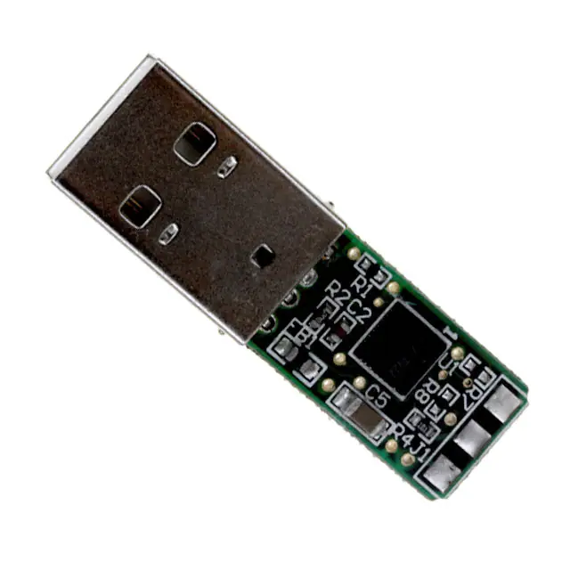
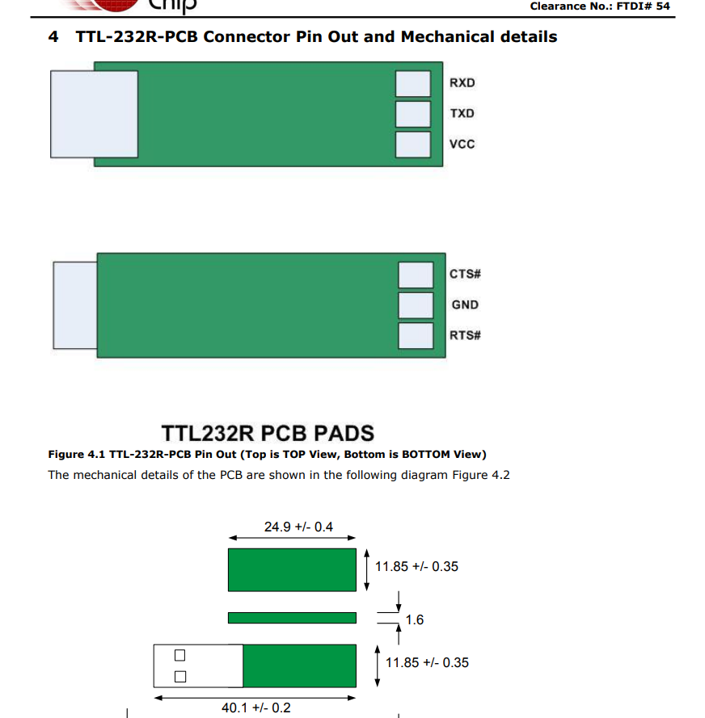
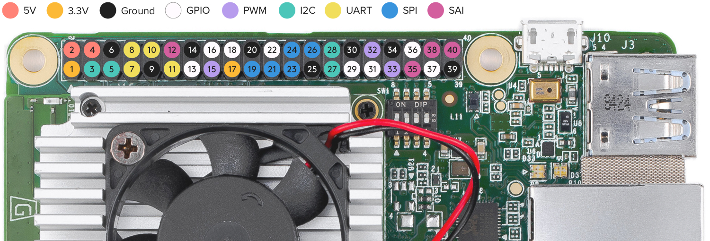

# Firmware Flashing and Pixhawk Setup

At this point of time the Raspberry Pi and PIXHAWK can be connected using FTDI connector :

## FTDI USB Connector




If you have a FTDI USB connector of this sort, the TX and RX ports needs to be swapped and VCC disconnected.

Open the serial port by running the below command on the Raspberry Pi terminal.

`$ sudo chmod 666 /dev/ttyUSB0`

Connect the wires as per the following table.

|FTDI Port|TELEM 2 PINOUT|
|---|---|
|VCC – Do not Connect…!|VCC|
|RX	|TX|
|TX	|RX|
|RTS|	CTS|
|CTS|	RTS|
|GND|	GND|

<!---

## GPIO PINS



The GPIO Pins can be connected to PIXHAWK using the below configuration : 

|GPIO PINS	|TELEM 2 PINOUT|
|---|---|
|PIN 8 (TX)|	RX|
|PIN 10 (RX)|	TX
|PIN 9 (GND)|	GND|

**DO NOT Connect the VCC pin…!**

Open the serial port by running the below command on the Upboard
```
sudo chmod 666 /dev/ttyS4
dmesg | grep tty
```
should show that ttyS4 is MMIO if the UPBoard kernel is properly installed and the connections properly made.

--->