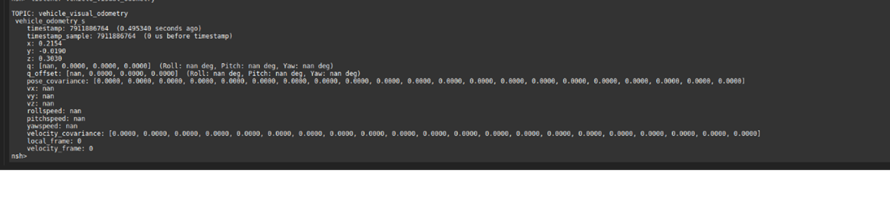

# Launching the MicroRTPS Agent and VRPN Nodes

## Table of Contents

1. [Launching the MicroRTPS Agent](##micrortps-agent)
2. [Launching the VRPN Nodes](#vrpn-nodes)

## MICRORTPS Agent

Ensure you have permission specified to access all the serial ports.
```
sudo groups $USER 
sudo usermod -a -G dialout $USER
```

- Open a Terminal and run the following commands:
- Source ROS2 and Workspace
```
source /opt/ros/foxy/setup.bash
source ~/colcon_ws/install/local_setup.bash
```
Run the following command to launch the MicroRTPS Agent:
```
micrortps_agent -t UART -b 1500000 -d /dev/ttyUSB0 -v
``````
This should launch micrortps_agent and the communication between the Upboad and PIXHAWK should have been established. You can check this by echoing the sensorcombined topic. 

```
ros2 topic echo /fmu/sensor_combined/out 
```

You should be able to see the IMU values on your terminal

On the PIXHAWK side, in the console enter the following command to check if the micrortps_client is running:
```
micrortps_client status
```
At this point you have successfully established the connection pipeline between the Upboard and PIXHAWK, the upcoming steps will help you to inject the Mocap data into the PIXHAWK.

## VRPN Nodes

Run the following commands to launch the VRPN nodes:
```
ros2 launch vrpn_client_ros sample.launch.py
ros2 run px4_vrpn_pubsub mocap_pubsub
```

This should launch the VRPN nodes and the communication between the Raspi and the VRPN server should have been established. If you had already launched the micrortps_agent, you can check this by echoing the `vehicle_visual_odometry` topic in the QGC.

```
listener vehicle_visual_odometry
```

This should see the data being published and should look like this. 



Also in the MAVLink Inspector you should see the topic `LOCAL_POSITION_NED` topic.
